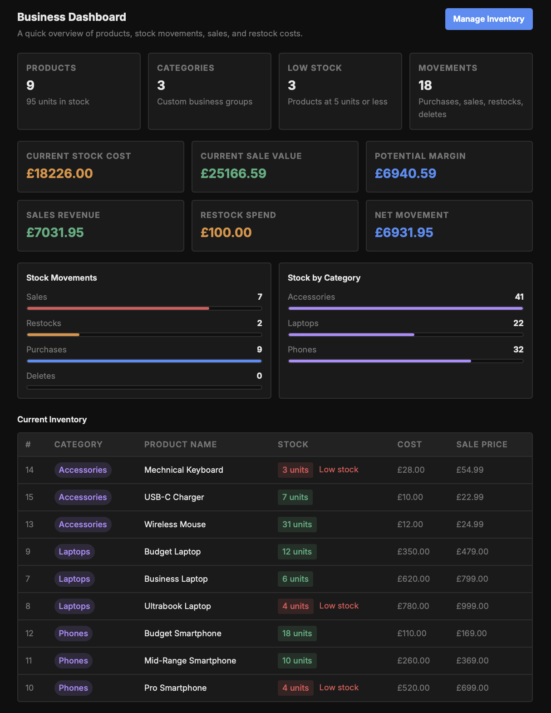
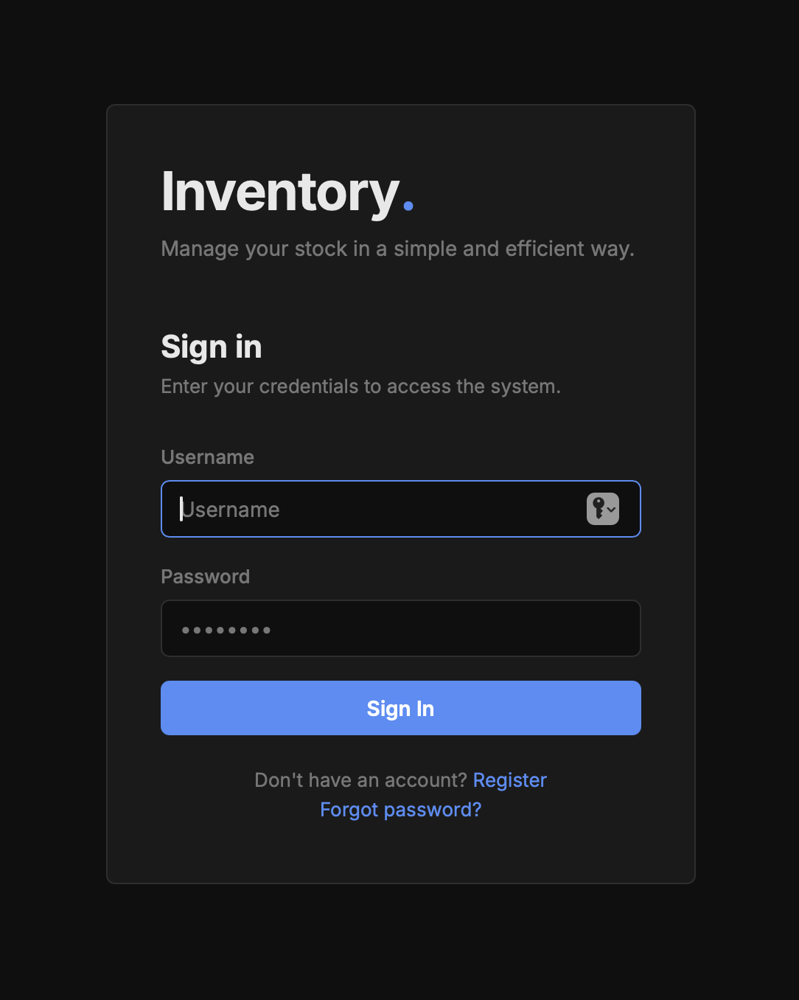
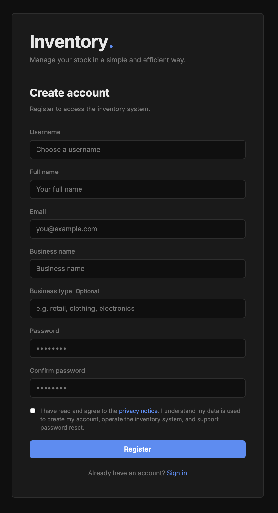
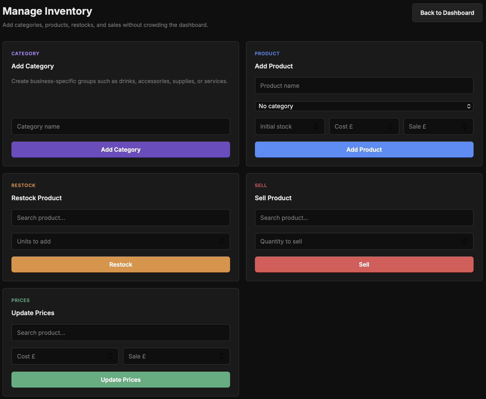
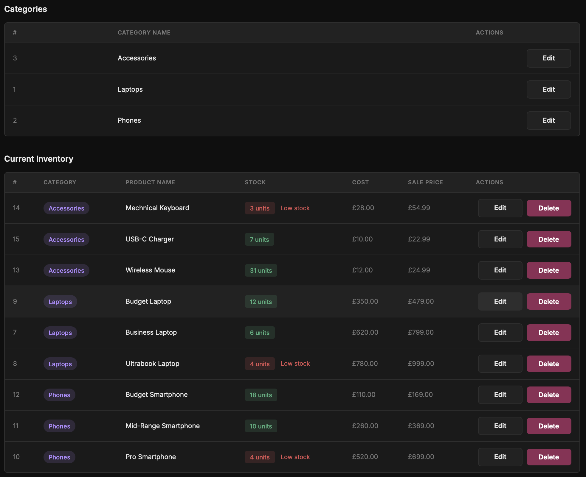
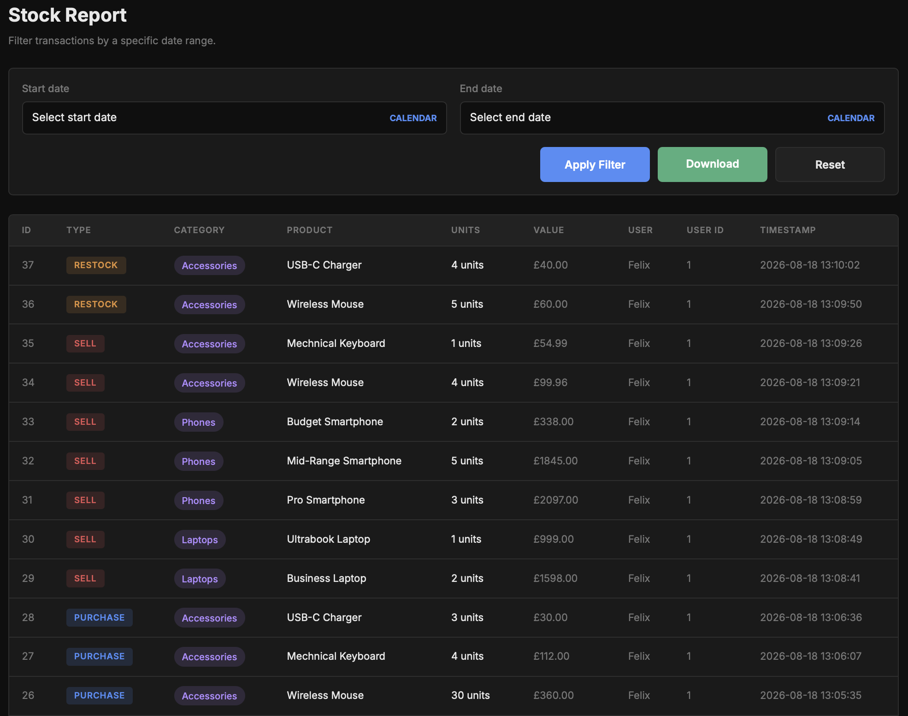
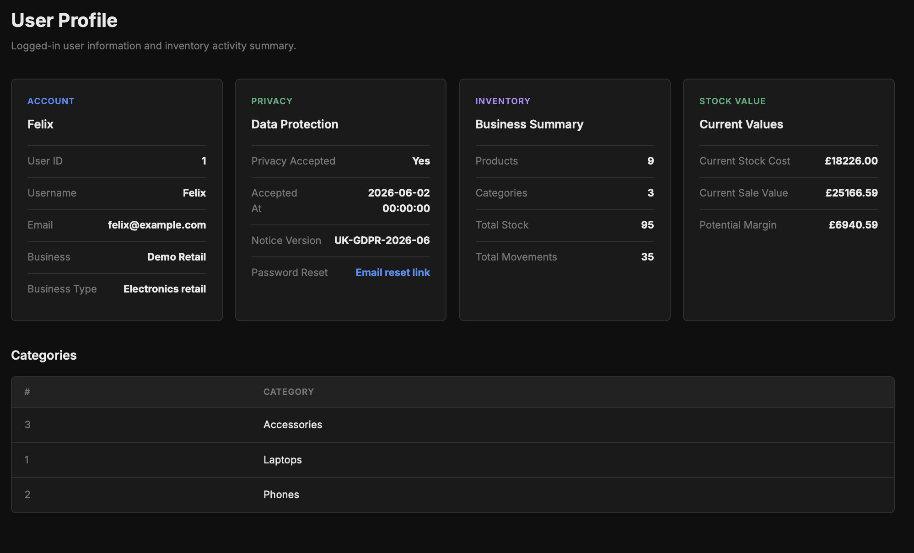

# Human-Centred Inventory Management System


A full-stack inventory management application designed to help small businesses manage stock with less complexity and clearer decision support.

Built with **Python, Flask and MySQL**, the system combines product and category management, sales and restock tracking, low-stock warnings, business metrics, privacy-aware user accounts and downloadable transaction reports in one accessible interface.

The guiding principle is simple:

> **Technology should support people, not replace their judgement.**

## Dashboard



The dashboard turns operational data into an immediate business overview, including current stock cost, potential sales value, expected margin, sales revenue, restock spending, low-stock products and category distribution.

> The screenshots use fictional demonstration data and do not contain real customer or business information.

## Award

This project was presented as **Human-Centred Retail Inventory Management System for Small Businesses** at the **Human Work Interaction Design (HWID) Conference**, hosted by the University of West London.

It received the **Best Poster Award – First Place**.

The conference project explored how affordable digital tools can reduce cognitive workload, improve stock visibility and help small-business workers make informed decisions while retaining human control.

## Key Features

### Inventory and business operations

- Create and organise custom product categories
- Add and edit products with cost and sale prices
- Record initial purchases, sales and restocks
- Update prices without recreating products
- Monitor current quantities and low-stock products
- Review stock distribution by category
- Track stock cost, potential sale value and expected margin
- Compare sales revenue with restock spending

### Accounts, privacy and reporting

- User registration and secure authentication
- Password hashing and email-based password reset
- Business and user profile information
- Privacy consent with a versioned UK GDPR notice
- Complete transaction history with timestamps and values
- Date-range filtering
- Downloadable PDF stock reports
- User-specific products, categories and transactions

### Software quality

- Object-oriented domain models
- Parameterised database queries
- Environment-based configuration
- Separation of application, data-access and presentation logic
- Unit tests for core product, transaction and authentication behaviour

## Application Screens

### Secure access and privacy-aware registration

<table>
  <tr>
    <td width="50%" align="center"><strong>Sign in</strong></td>
    <td width="50%" align="center"><strong>Create an account</strong></td>
  </tr>
  <tr>
    <td></td>
    <td></td>
  </tr>
</table>

### Inventory operations

The management workspace keeps frequent actions separate from the dashboard, reducing visual clutter while keeping category creation, product entry, sales, restocks and price updates accessible.



The inventory table provides clear category labels, cost and sale prices, stock status and visible low-stock warnings.



### Transaction reporting



### User and business profile



## Human-Centred Design

The application was designed around the needs of small-business users who may not have specialist inventory or technical knowledge. Its purpose is to reduce repetitive work and make important information easier to understand, while leaving operational decisions with the user.

The interface applies this approach through:

- Clear navigation and consistent colour-coded actions
- Simple forms with focused tasks
- Immediate feedback after inventory operations
- Visible low-stock warnings
- Business metrics presented in plain language
- Separation of the overview dashboard from management controls
- Privacy information and explicit consent during registration

This direction aligns with **Human Work Interaction Design** and the human-centred principles of **Industry 5.0**.

## Technology Stack

| Layer | Technologies |
|---|---|
| Backend | Python, Flask, Object-Oriented Programming |
| Database | MySQL, MySQL Connector for Python |
| Frontend | HTML, CSS, JavaScript, Jinja2 templates |
| Security and configuration | Werkzeug, python-dotenv, server-side sessions |
| Reporting | WeasyPrint, HTML-based PDF generation |
| Testing | Python `unittest` |

## Project Structure

```text
human-centred-inventory-system/
├── app.py
├── database.py
├── requirements.txt
├── .env.example
├── .gitignore
├── README.md
├── models/
│   ├── product.py
│   ├── transaction.py
│   ├── user.py
│   ├── dashboard_data.py
│   ├── inventory_data.py
│   ├── report_data.py
│   ├── user_data.py
│   ├── form_utils.py
│   ├── schema.py
│   └── pdf_utils.py
├── templates/
│   ├── dashboard.html
│   ├── manage_inventory.html
│   ├── stock_report.html
│   ├── profile.html
│   ├── login.html
│   ├── register.html
│   ├── forgot_password.html
│   ├── reset_password.html
│   ├── edit_product.html
│   ├── edit_category.html
│   ├── privacy_notice.html
│   └── report_download.html
├── static/
│   ├── CSS/
│   └── js/
├── database/
│   └── retail_inventory_db.sql
├── screenshots/
│   ├── dashboard-overview.png
│   ├── login-overview.png
│   ├── registration.png
│   ├── manage-inventory.png
│   ├── manage-inventory2.png
│   ├── stock-report.png
│   └── user-profile.png
└── tests/
    └── test_models.py
```

## Installation

### Prerequisites

- Python 3
- MySQL Server
- `pip`

WeasyPrint may require additional native libraries depending on the operating system.

### 1. Clone the repository

```bash
git clone https://github.com/FeliceParrino/human-centred-inventory-system.git
cd human-centred-inventory-system
```

### 2. Create and activate a virtual environment

macOS or Linux:

```bash
python3 -m venv .venv
source .venv/bin/activate
```

Windows:

```bash
python -m venv .venv
.venv\Scripts\activate
```

### 3. Install the dependencies

```bash
pip install -r requirements.txt
```

### 4. Configure environment variables

Copy `.env.example` to a new local `.env` file:

```bash
cp .env.example .env
```

Add your local configuration:

```env
SECRET_KEY=replace-with-a-random-secret-key

DB_HOST=localhost
DB_USER=root
DB_PASSWORD=your-database-password
DB_PORT=3306
DB_NAME=retail_inventory_2

SMTP_HOST=smtp.example.com
SMTP_PORT=587
SMTP_USER=your-email@example.com
SMTP_PASSWORD=your-email-password
SMTP_FROM=your-email@example.com
```

Do not commit the `.env` file or real credentials to GitHub.

### 5. Set up MySQL

Create the database by importing:

```text
database/retail_inventory_db.sql
```

For example:

```bash
mysql -u root -p < database/retail_inventory_db.sql
```

### 6. Run the application

```bash
python app.py
```

Open [http://127.0.0.1:5000](http://127.0.0.1:5000) in a browser.

## Testing

The test suite covers:

- Product stock changes
- Purchase and sale transactions
- Prevention of sales exceeding available stock
- Password hashing
- Password verification

Run the tests with:

```bash
python -m unittest tests/test_models.py
```

## Architecture

The application follows a layered structure:

1. Flask routes handle HTTP requests, sessions and application flow.
2. Jinja2 templates provide the user interface.
3. Domain models represent users, products and transactions.
4. Data-access modules query MySQL and prepare dashboard, inventory, profile and report information.

This separation makes the system easier to understand, test and extend.

## Future AI-Supported Development

AI forecasting is a planned development and is **not presented as a completed feature in the current version**.

The proposed workflow would use historical sales and stock movements to provide explainable decision support, such as:

- Demand forecasts
- Stockout-risk identification
- Suggested reorder quantities
- Estimated stock-depletion dates
- Unusual inventory-pattern detection
- Confidence notes explaining the basis of each recommendation

Recommendations would remain reviewable rather than automatic:

> **The system can recommend; the business user makes the final decision.**

Possible later developments also include barcode scanning, cloud deployment, role-based access, automated low-stock notifications and supplier management.

## Project Status

The current version is a functional academic and portfolio project intended for local demonstration and further development. It should not be treated as production-ready software without additional security review, deployment hardening, accessibility testing and operational monitoring.

## Usage and Copyright

Copyright © 2026 Felice Parrino. All rights reserved.

The source code is publicly visible for portfolio and evaluation purposes. No permission is granted to copy, modify, redistribute, sublicense, sell or use the software commercially without prior written permission from the author.

No open-source licence is granted.

## Author

**Felice Parrino**  
Computer Science Student — London, United Kingdom

- GitHub: [FeliceParrino](https://github.com/FeliceParrino)
- LinkedIn: [Felice Parrino](https://www.linkedin.com/in/felice-parrino-b43940259/)
